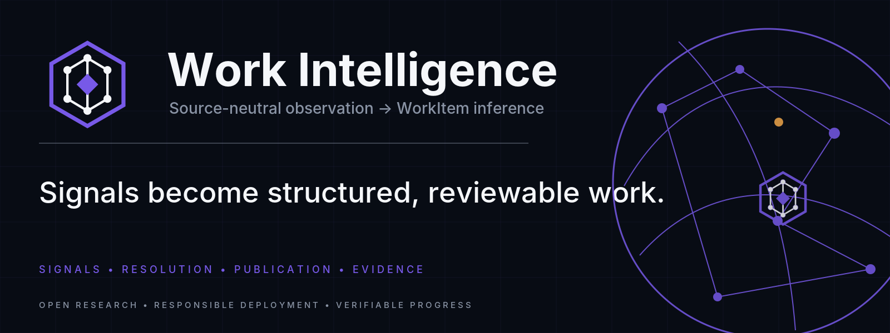
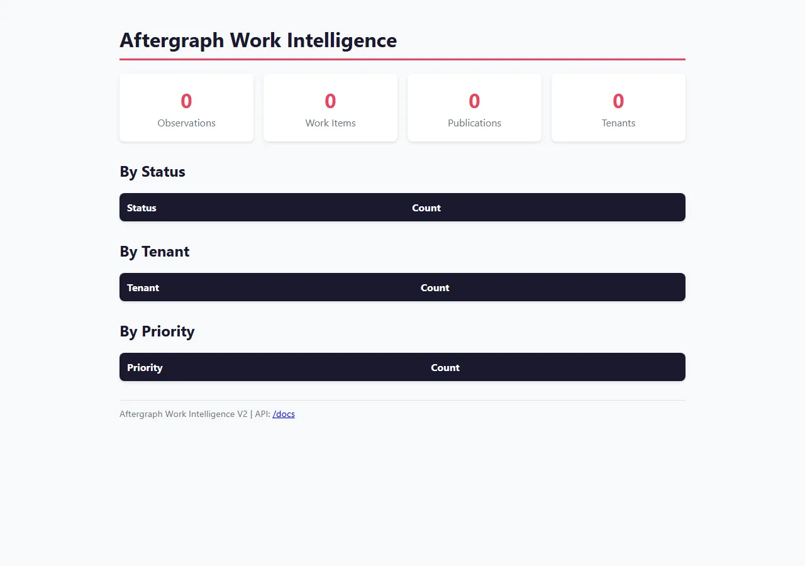
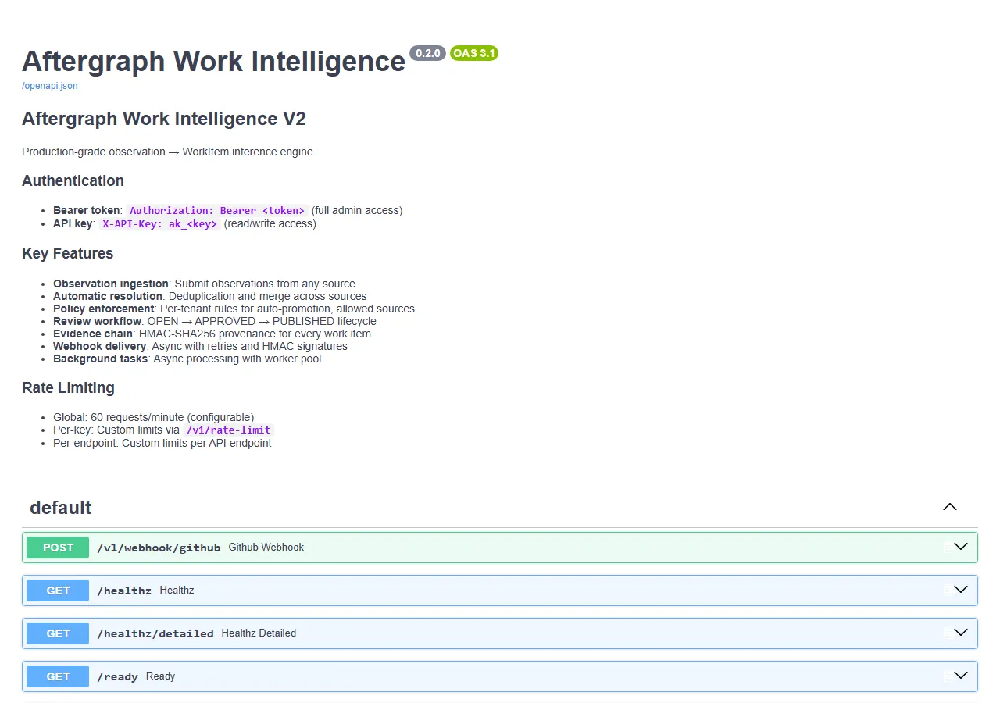
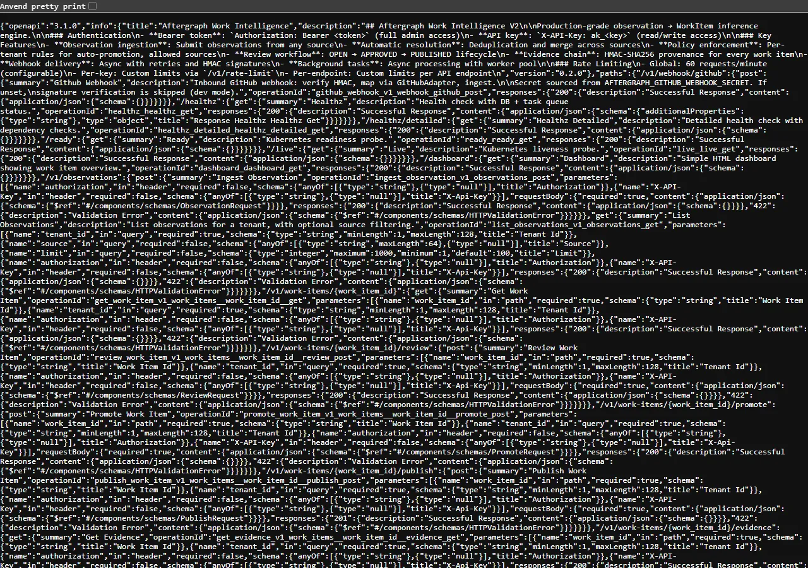
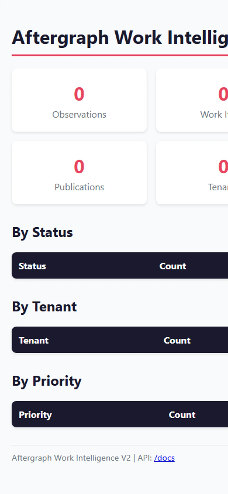

<!-- aftergraph-brand-os:v1.0.0 -->
<p align="center">
  <picture>
    <source media="(prefers-color-scheme: dark)" srcset=".github/assets/github/hero.webp">
    
  </picture>
</p>

# Aftergraph Work Intelligence V2

**Production-grade observation → WorkItem inference engine.**

Source-neutral automatic work detection. Humans keep working in conversation, email, calendars, code, or other systems; adapters send observations here; the engine creates or updates canonical work automatically.

> **V2 status:** production integration. Real source adapters, tenant policies, review/approval flow, destination publishers (RenOS + WORKS), provenance/evidence, observability, and end-to-end tests. Built TDD-first against the actual Aftergraph contracts.

## Core invariant

**Work creates tickets. Humans do not create tickets.**

The canonical object is a `WorkItem`, not a destination-specific ticket:

```
Signal → Observation → WorkCandidate → Resolution → WorkItem
       → Review/Approve → Publication → optional WORKS promotion → Evidence
```

A WorkItem can later publish to RenOS, Linear, Jira, GitHub, or an execution system without changing the inference core.

## Quick Start

```bash
# Install dependencies
pip install -e '.[dev]'

# Run tests (634 test cases)
pytest

# Start the service
aftergraph-work-intelligence --db ./data/work-intelligence.db

# API docs available at http://127.0.0.1:8087/docs
```

## Product visuals

Real captures from a running service (headless Chrome, `python -m
aftergraph_work_intelligence.api --port 8811`, exact HEAD `44def8d` — see
`.github/assets/screenshots/README.md` for provenance):

<p align="center">
  
  <br><em>Dashboard</em>
</p>

<p align="center">
  
  <br><em>API documentation (Swagger UI)</em>
</p>

<p align="center">
  
  <br><em>OpenAPI spec</em>
</p>

<p align="center">
  
  <br><em>Dashboard — mobile viewport</em>
</p>

## Architecture

```
┌─────────────────────────────────────────────────────────────────┐
│                         Sources                                  │
│  (conversation, email, calendar, code, renos adapters)          │
└─────────────────────┬───────────────────────────────────────────┘
                      │ observations
                      ▼
┌─────────────────────────────────────────────────────────────────┐
│                    Aftergraph Work Intelligence                  │
│                                                                  │
│  ┌──────────────┐    ┌──────────────┐    ┌──────────────┐       │
│  │  Adapter     │───▶│  Store       │───▶│  Policy      │       │
│  │  Layer       │    │  (SQLite)    │    │  Engine      │       │
│  └──────────────┘    └──────────────┘    └──────────────┘       │
│           │                │                │                   │
│           ▼                ▼                ▼                   │
│  ┌───────────────────────────────────────────────────────┐    │
│  │                    Inference Core                      │    │
│  │  • Deduplication & merge across sources               │    │
│  │  • Automatic work-item resolution                     │    │
│  │  • State machine (OPEN → APPROVED → PUBLISHED)        │    │
│  │  • Tenant policy enforcement                          │    │
│  └───────────────────────────────────────────────────────┘    │
│           │                │                │                   │
│           ▼                ▼                ▼                   │
│  ┌──────────────┐    ┌──────────────┐    ┌──────────────┐       │
│  │  Publisher   │◀───│  Cache       │◀───│  Rate        │       │
│  │  Router      │    │  (LRU, TTL)  │    │  Limiter     │       │
│  └──────────────┘    └──────────────┘    └──────────────┘       │
│                                                                  │
│  ┌──────────────┐    ┌──────────────┐    ┌──────────────┐       │
│  │  Webhook     │    │  Request     │    │  Telemetry   │       │
│  │  Dispatcher  │    │  Logger      │    │  (OTLP)      │       │
│  └──────────────┘    └──────────────┘    └──────────────┘       │
│                                                                  │
└─────────────────────────────────────────────────────────────────┘
                      │
                      ▼
┌─────────────────────────────────────────────────────────────────┐
│                    Destinations                                  │
│  (RenOS, WORKS, Webhooks, custom publishers)                     │
└─────────────────────────────────────────────────────────────────┘
```

## API Reference

### Authentication

- **Bearer token**: `Authorization: Bearer ***` (full admin access)
- **API key**: `X-API-Key: ***` (read/write access)
- API keys use SHA-256 hashing; provenance chain uses HMAC-SHA256

### Endpoints

#### Health & System

| Method | Endpoint | Description |
|--------|----------|-------------|
| GET | `/healthz` | Health check with DB, task queue, and cache status |
| GET | `/version` | Version and feature flags |
| GET | `/monitoring` | System metrics (CPU, memory, disk) |
| GET | `/metrics` | Service metrics counters |

#### Work Items

| Method | Endpoint | Description |
|--------|----------|-------------|
| POST | `/v1/observations` | Ingest observation and auto-resolve work |
| GET | `/v1/work-items` | List work items (filter by status, priority) |
| GET | `/v1/work-items/{id}` | Get work item with observations and publications |
| POST | `/v1/work-items/{id}/review` | Approve/reject/snooze/cancel work item |
| POST | `/v1/work-items/{id}/promote` | Promote to WORKS (policy-gated) |
| POST | `/v1/work-items/{id}/publish` | Publish to destination |
| GET | `/v1/work-items/{id}/evidence` | Get provenance/evidence envelope |
| GET | `/v1/work-items/{id}/transitions` | Get transition history |
| GET | `/v1/work-items/{id}/publications` | Get publication history |

#### Management

| Method | Endpoint | Description |
|--------|----------|-------------|
| GET | `/v1/migrations` | Run and report migrations |
| GET | `/v1/cache` | View cache stats and manage |
| GET | `/v1/rate-limit` | Check rate limit status |
| POST | `/v1/rate-limit` | Set custom rate limit |
| POST | `/v1/webhooks` | Register webhook endpoint |
| GET | `/v1/webhooks/stats` | Get webhook delivery stats |
| GET | `/v1/logs` | View recent request logs |

#### Search & Tenants

| Method | Endpoint | Description |
|--------|----------|-------------|
| GET | `/v1/search` | Search work items by title/summary |
| GET | `/v1/tenants` | List all tenants with counts |
| GET | `/v1/tenants/{id}/policy` | Get tenant policy |
| POST | `/v1/tenants/{id}/policy` | Update tenant policy |

### WebSocket

Real-time updates via WebSocket connection:
- Heartbeat: every 30 seconds
- Client tracking: active client count
- Stats: connection metrics

### Custom Exception Types

The service defines 9 custom exception classes for structured error handling:

1. `WorkIntelligenceError` - Base exception (500)
2. `ObservationError` - Observation processing failed (422)
3. `DeduplicationError` - Deduplication failed (422)
4. `PolicyViolationError` - Tenant policy violation (403)
5. `PromotionError` - Work item promotion failed (422)
6. `PublicationError` - Publication failed (502)
7. `AuthenticationError` - Auth failed (401)
8. `AuthorizationError` - Insufficient permissions (403)
9. `NotFoundError` - Resource not found (404)

## Configuration

### Environment Variables

```bash
# Database
AFTERGRAPH_DB_PATH=./aftergraph-work-intelligence.db

# Authentication
AFTERGRAPH_API_TOKEN=your-secret-token
AFTERGRAPH_EVIDENCE_SECRET=your-evidence-secret

# Rate limiting
AFTERGRAPH_RATE_LIMIT=60

# Logging
AFTERGRAPH_LOG_REQUEST_BODY=false
AFTERGRAPH_LOG_RESPONSE_BODY=false
AFTERGRAPH_BODY_LOG_MAX_CHARS=1000
AFTERGRAPH_MAX_REQUEST_SIZE=10485760

# OpenTelemetry
OTEL_EXPORTER_OTLP_ENDPOINT=http://localhost:4317
```

### Tenant Policies

Policies enforce per-tenant rules:

```python
from aftergraph_work_intelligence.policy import PolicyStore, TenantPolicy

policy_store = PolicyStore()
policy_store.put("renos", TenantPolicy(
    allowed_sources={"conversation", "email", "calendar", "renos"},
    allowed_destinations={"renos", "works"},
    allow_works=True,          # opt-in to WORKS promotion
    max_work_items=100,
    max_priority="high",
    dedupe_threshold=0.72,
    auto_create_work_items=True,
    require_approval_for_promotion=True,
))
```

### Cache

- **TTL-based**: default 300 seconds
- **Max size**: 1000 entries (configurable to 5000)
- **Eviction**: LRU (Least Recently Used)
- **Stats available**: hits, misses, evictions, current size

### Rate Limiting

- **Global**: 60 requests/minute (configurable)
- **Per-endpoint**: Custom limits per API endpoint
- **Per-key**: Custom limits via `/v1/rate-limit`
- **Usage stats**: Available at `/v1/rate-limit`

### Migrations

- Versioned database migrations (3 current)
- Run automatically on startup
- Migration version exposed via `/healthz`

## Development

```bash
# Run all tests
pytest -v

# Run specific test file
pytest tests/test_api.py

# Type checking
mypy src/aftergraph_work_intelligence/

# Code formatting
black src/aftergraph_work_intelligence/
```

### Test Structure

- **634 tests** covering all modules
- TDD-first: every module has failing test before implementation
- End-to-end tests use in-process RenOS/WORKS fakes
- Real HTTP round-trips (no mocks as final evidence)

## Observability

### OpenTelemetry

- OTLP exporter: `http://localhost:4317`
- Console exporter for debugging
- Traces: every request with span timing

### Request Logging

- JSONL format with rotation
- Log directory: `logs/requests_<timestamp>.jsonl`
- Max size: 100MB per file
- Retention: 7 days

### Metrics

- Request counts by path and status
- Response time histograms
- Cache hit/miss ratios
- Background task queue stats

## Security

### API Keys

- SHA-256 hashed storage
- Prefix-based validation (`ak_` prefix)
- Read/write access only (no admin)

### Evidence Chain

- HMAC-SHA256 signatures
- Content-addressed envelopes
- Verifiable offline

### Request Logging

- Body logging disabled by default (env-var controlled)
- Max body size: 10MB
- Automatic log rotation

## License

MIT License - see LICENSE file in repository.
